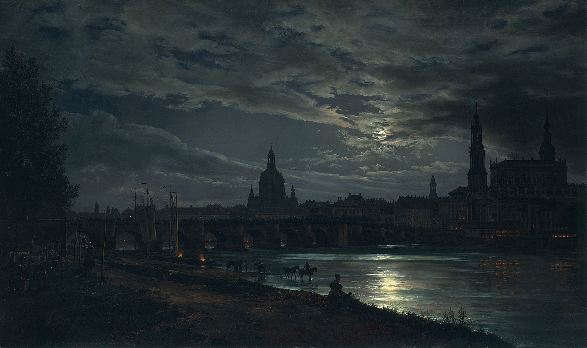

# Infinite Parallax

In Unity, infinite parallax is a technique used to create the illusion of depth in 2D games. This is done by moving the background layers at different speeds, creating a parallax effect.

In the realm of AI image generation, *infintie zoom* is a technique used to create the illusion of an infinite zoom, by taking an image, decreasing its size, inpainting the padding around it to match the original size, repeating the process, and then stitching the images together.

Infinite Parallax combines these ideas. In other words, it leverages AI tools that allow for automated depth maps and automated segmentation with certain Stable Diffusion models and techniques' abilities to seemlessly inpaint images in a context-aware manner to create intermediate frames whose magnitude of change varies with the y-axis of the image -- with each y-axis "slice" or "layer"'s velocity varying with the calculated depth.

## Demo

**Input Image**



*View of Dresden by Moonlight* by Johan Christian Dahl

**Output Video**


Low quality, bad color conversion, and short length are just products of requiring a gif for github markdown compiler. In the full video, the parallax effect goes until the entire original image is gone

## Process

Most steps will be accomplished using ComfyUI nodes. Some steps will require new code to be written, which can be converted into a node later such that the entire process can be a single ComfyUI workflow.

### Input Image

```python
image_path = input("Path to image: ")
START_IMAGE = Image.open(image_path)
WIDTH = START_IMAGE.width
HEIGHT = START_IMAGE.height
```

### Depth Maps (Optional)

- MiDaS Depth Approximation automatically calculates depth maps for images. This can be used to calculate the depth of each pixel in the image.
- The depth map serves two purposes, both optional:
  - It can be used to calculate the velocity of each layer, with the velocity being inversely proportional to the depth.
  - It can be used with ControlNet conditioning, to assure that the inpainting process creates intermediate frames with uniform depth.

### Segmentation (Optional)

- GroundingDinoSAMSegment with user input prompts can be used to segment the image into layers. 
- This provides specific initial shifts for the layers, and is later used to determine the base height for each layer

### Finalize Parameters with User Input

#### Direction Angle (0-360 degrees)

In degrees, the direction of the parallax effect. 0 degrees is to the right, 90 degrees is up, 180 degrees is left, and 270 degrees is down.

```python
print(
    "Direction of Parallax (0-360 degrees)",
    "0 degrees is to the right",
    "90 degrees is up",
    "180 degrees is left",
    "270 degrees is down"
    )
direction = input()
direction_theta = math.radians(direction)

def get_velocity_vector(direction_theta, velocity):
    return (velocity * math.cos(direction_theta), velocity * math.sin(direction_theta))
```
#### Number of Layers

```python
layers = []
if not using_segmentation:
    num_layers = input("Number of Layers: ")

    for i in range(num_layers):
        layers.append({})
```

#### Layer Heights

```python
if not using_segmentation:
    print("Layers start from the top of the image and go down")
    print("The top layer is Layer 0. The bottom layer is Layer N-1.")

    for i in range(num_layers):
        layers[i]["height"] = input(f"Height of Layer {i} (in pixels): ")

        if i == len(layers) - 1:
            print(
                "The last layer is calculated automatically",
                "to ensure the entire image is covered."
                )

            total_height_last_layer = sum([layer["height"] for layer in layers[:-1]])
            height_last_layer = image_height - total_height_last_layer
            print(f"Height of last layer: {height_last_layer}px")
```

#### Layer Distances

Approximate Depth/Distance of each layer from the camera


```python
# Defaults

DEFAULT_DISTANCES = {
    "cloud_layer" : {
        "mathematically_accurate_distance" : 16.18,
        "creates_best_output_distance" : 280
    },
    "horizon_layer" : {
        "mathematically_accurate_distance" : .15,
        "creates_best_output_distance" : 50
    },
    # Past depth of field in landscape paintings
    "background_layer" : {
        "mathematically_accurate_distance" : 689,
        "creates_best_output_distance" : 690
    },
    "foreground_layer" : {
        # Arbitrary base
        "mathematically_accurate_distance" : 800,
        "creates_best_output_distance" : 800
    }
}
```

```python
if not using_depth_maps:
    print(
        "You can think of distance in terms of whatever unit you want,",
        "as long as it's consistent.",
        "For example, you can give distance on a scale of 0-100,",
        "where 0 is right in front of the camera",
        "and 100 is the horizon."
        )

    for i in range(num_layers):
        layers[i]["distance"] = input(f"Distance of Layer {i} from the camera: ")
        # Clean any units or non-numeric characters and convert to float
        layers[i]["distance"] = re.sub("[^0-9]", "", layers[i]["distance"])
        layers[i]["distance"] = float(layers[i]["distance"])

# Convert distances to ratios of longest distance
longest_distance = max([layer["distance"] for layer in layers])
for i in range(num_layers):
    layers[i]["distance_ratio"] = layers[i]["distance"] / longest_distance
```

***NOTE:*** Distances can also be caculated mathematically given the angle of the camera and the height of the layer, but upon testing, it doesn't necessarily improve the quality of outputs. Probably because the subjective quality of outputs doesnt correlate very strongly with the mathematical exactness of layer velocities. The human optical system automatically contextualizes visual errors before they reach the level of cognitive awareness either way, that's why we can simulate parallax with 2D images in the first place.

#### Smoothness

```python
print(
    "Smoothness",
    "The base change in distance in between each inpainting step",
    "More smoothness means more intermediate frames, and a smoother transition",
    "at the cost of more time and memory"
)

SMOOTHNESS = int(input("(int) Smoothness (recommended 20-100): "))
```

***NOTE:*** In essence, each step will be a "perfect" image, in the sense that it was created with full context. The period of time wherein the layers are moving at different speeds toward the next step will be the period where the layers are "mismatched" and there will inevitably be illogical disjointedness in the reality of the picture. The less distance between each step means the less total time that the layers are disjointed. 

***NOTE:*** On the other hand, a higher number of iterations can amplify the non-convergence of the inpainting process. That is, if the inpainting or diffusion models/parameters are in any way divergent, each step may tend towards a (potentially radically) different "reality". This effect can be observed in img2vid processes, where there is a trade-off between FPS and inter-frame communication (given an environment where virtual memory is a limiting factor)

#### FPS

```python
print(
    "Frames Per Second",
    "The base speed of the final video",
    "Lower FPS usually creates better results"
)

FPS = int(input("(int) Frames Per Second: "))
```

### Velocity Calculations

```python


def get_velocity_vector(direction_theta, velocity):
    return (velocity * math.cos(direction_theta), velocity * math.sin(direction_theta))

for i in range(num_layers):
    layers[i]["velocity"] = get_velocity_vector(direction_theta, layers[i]["distance_ratio"])
    layers[i]["velocity"] = (layers[i]["velocity"][0] * SMOOTHNESS, layers[i]["velocity"][1] * SMOOTHNESS)
```

### Number of Steps Calculation

```python
# Each layer requires enough steps so that it can move the full distance of the image
# This is calculated by dividing the distance of the layer by the velocity of the layer
for i in range(num_layers):
    layers[i]["steps"] = (WIDTH / layers[i]["velocity"][0], HEIGHT / layers[i]["velocity"][1])
    layers[i]["steps"] = (int(layers[i]["steps"][0]), int(layers[i]["steps"][1]))

MAX_STEPS = max([layer["steps"] for layer in layers])
```

***NOTE:*** The number of steps will always be the max steps required by the slowest layer. But each layer needs its own steps to determine how many output layers are used in the stitching process.


### Step Process (Repeated `MAX_STEPS` Times)

#### 1 - Cropping and Masking

1. Crop current step's start image into horizontal layers based on the layer heights
2. Crop each layer based on its velocity (essentially shifting it outside the base canvas in *velocity* vector distance/direction)
3. Composite the layers back onto the original canvas alpha, flush/aligned with the direction of the velocity vector
   1. E.g., if the direction is left (180 degrees), the layers are cropped `velocity` pixels from their left side, and then composited onto the original canvas flush with the left side of the canvas
4. Add alpha layer or mask to the canvas's empty space

### 2 - Inpaint Mask Preprocessing (Optional)

Each step optional, with user experimentation suggested to determine the best results. Generally, this order should be followed:

1. Grow mask 
   1. in the direction opposite of the velocity vector
   2. in a magnitude equal to the extent of feathering/blurring
2. Taper/Round corners
3. Mask blur
   1. Gaussian blur
   2. Blur radius
   3. Lerp alpha
   4. Falloff ratio / decay factor
4. Mask feathering

### 3 - Inpainting

Inpaint the composited layers such that the process uses the entire context


### 4 - Re-Separate Layers

Crop the inpainted image back into layers based on the layer heights


```python
for i in range(num_layers):
    layers[i]["step_outputs"] = []
```

```python
for i in range(num_layers):
    layers[i]["step_outputs"].append(
        inpainted_recropped_layers[i]
    )
```

### Repeat *Step Process* `MAX_STEPS` Times

```python
start = START_IMAGE
for i in range(MAX_STEPS):
    # Separate start image into layers
    cropped_layers = [crop_layer(layer, start) for layer in layers]
    # Shift layers based on velocity
    shifted_layers = [shift_layer(layer) for layer in cropped_layers]
    # Composite layers onto base canvas, flush with the direction of the velocity vector
    composited_layers = composite_layers(shifted_layers, base_canvas)
    # Preprocess mask
    preprocessed_composite = preprocess_mask(composited_layers)
    # Inpaint
    inpainted_output = inpaint(composited_layers)
    # Re-separate layers
    inpainted_recropped_layers = [crop_layer(layer, inpainted_output) for layer in layers]
    for i in range(num_layers):
        layers[i]["step_outputs"].append(
            inpainted_recropped_layers[i]
        )

    start = inpainted_output
```

### Stitching

#### Create Layer Frames

- A frame for a given layer, requires layer["steps"] frames from layer["step_outputs"]
  - Either string the inpainted regions together, or composite them together on top of each other, shifted by the layer's velocity each step_output

#### Create Sliding Transition Video for each Layer

Slide speed is directly proportional to the velocity of the layer, such that the time of each layer's sliding transition video is the same

```python 
import subprocess

def create_sliding_transition(input_image1, input_image2, output_video, slide_speed):
    # Calculate the duration of the sliding transition based on slide_speed
    # For example, if slide_speed is 100 pixels per second, and the width of the image is 1920 pixels,
    # the duration will be width / slide_speed seconds
    duration = 1920 / slide_speed

    # Use ffmpeg to create the sliding transition
    subprocess.run([
        'ffmpeg',
        '-loop', '1', '-i', input_image1,
        '-loop', '1', '-i', input_image2,
        '-filter_complex', f'[0:v]setpts=PTS-STARTPTS[v0];[1:v]setpts=PTS-STARTPTS+{duration}/TB[v1];[v0][v1]overlay=x=\'min(-W+(W-W*{slide_speed}*t),0)\':y=0:shortest=1[v]',
        '-map', '[v]',
        '-c:v', 'libx264',
        '-t', str(duration),
        '-pix_fmt', 'yuv420p',
        output_video
    ])

# Example usage:
create_sliding_transition('image1.jpg', 'image2.jpg', 'sliding_transition.mp4', 100)
```

This script takes two input images (input_image1 and input_image2) and creates a sliding transition between them in the output video (output_video). The slide_speed parameter controls the speed at which the images slide, in pixels per second.

Adjust the slide_speed parameter as needed to control the speed of the sliding transition. The higher the value, the faster the images will slide.

#### Stack Sliding Layer Videos

```python
import subprocess

def stack_videos(input_videos, output_video):
    # Generate a filter complex string to stack the videos vertically
    filter_complex = ""
    for i, video in enumerate(input_videos):
        filter_complex += f"[{i}:v]scale=iw:ih, pad=iw:1920/{len(input_videos)} [v{i}];"
    for i in range(len(input_videos)):
        filter_complex += f"[v{i}]"

    # Use ffmpeg to stack the videos
    subprocess.run([
        'ffmpeg',
        '-i', input_videos[0],  # Use the first video to set the output format
        '-filter_complex', filter_complex + 'concat=n=' + str(len(input_videos)) + ':v=1:a=0[v]',
        '-map', '[v]',
        output_video
    ])

# Example usage:
input_videos = ['video1.mp4', 'video2.mp4', 'video3.mp4', 'video4.mp4', 'video5.mp4']
output_video = 'combined_video.mp4'
stack_videos(input_videos, output_video)
```

This script takes a list of input video filenames (input_videos) and combines them into a single video (output_video). It stacks the videos vertically, with each video having the same width but different heights. The total height of the final combined video will be the sum of the heights of the individual videos. Adjust the output height as needed in the pad=iw:1920/{len(input_videos)} part of the filter_complex string to match your desired resolution.

### Frame Interpolation

Interpolate the frames of each layer to match the FPS of the final video

### Video Editing

Various techniques can further the illusion of lifelike parallax, such as:

#### Effects

- Add effects which contribute to the linear temporal consistency of the video
    - E.g., a consistent moonlight ray VFX overlayed on the entire video
    - E.g., a consistent rain overlayed on the entire video
    - E.g., Osciilating distortion across frames

#### Sound

Sound effects can be added to the video to further enhance the illusion of depth. For example, the sound of wind or birds can be added to the background layers, while the sound of footsteps or voices can be added to the foreground layers.

Sound effects can vary in amplitude, attenuation, delay in a rate proportional to the simulated motion of the given layer

Possible sounds:
- Foley
- Music
- Sound Effects
- Ambiance
- Voices

#### Frame Blending and Keyframe Group Size

...