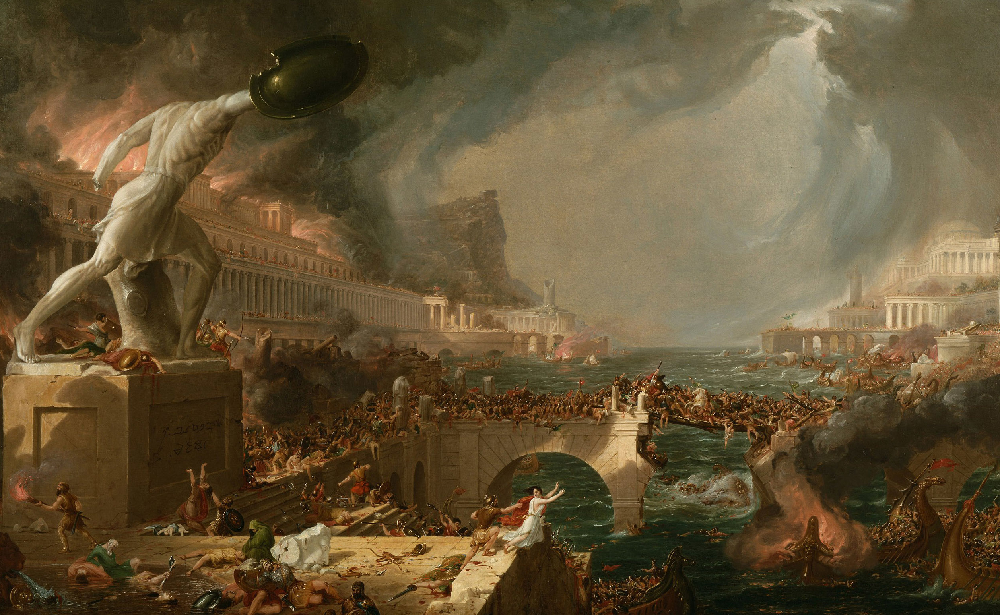
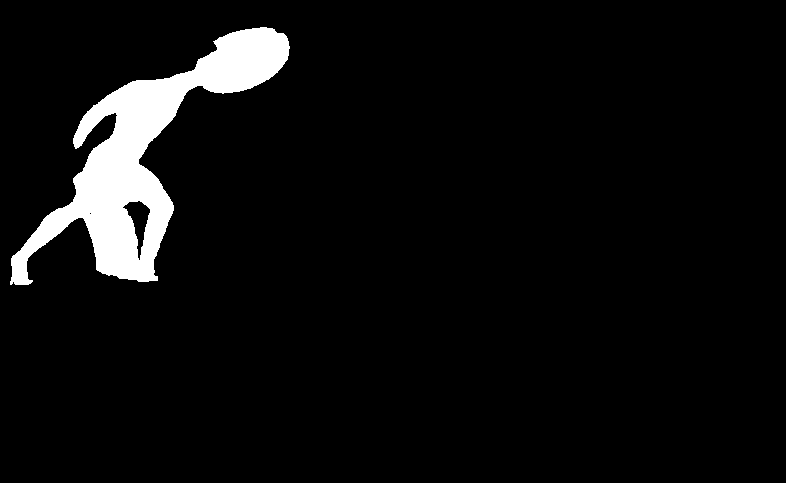
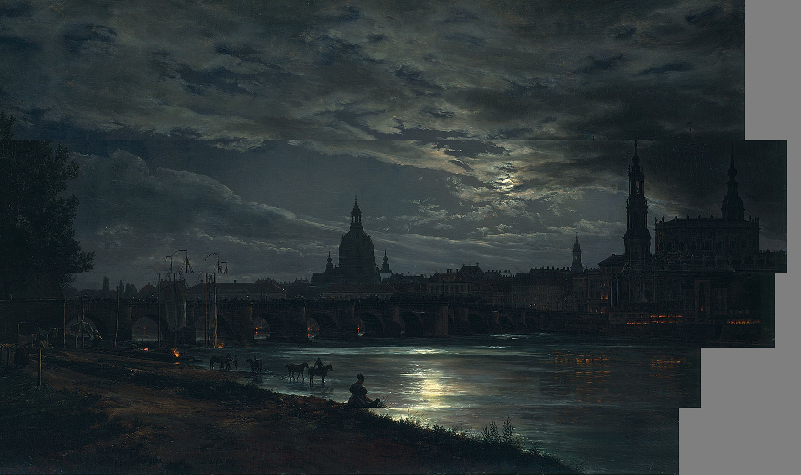
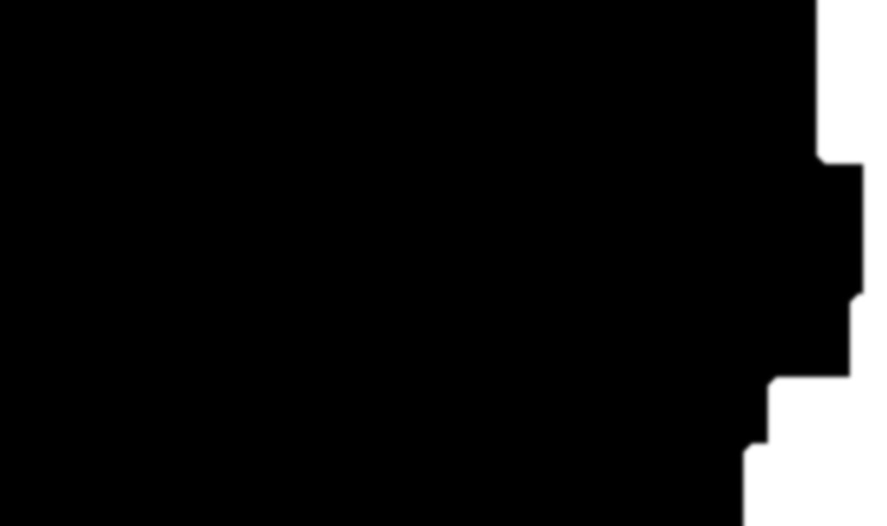
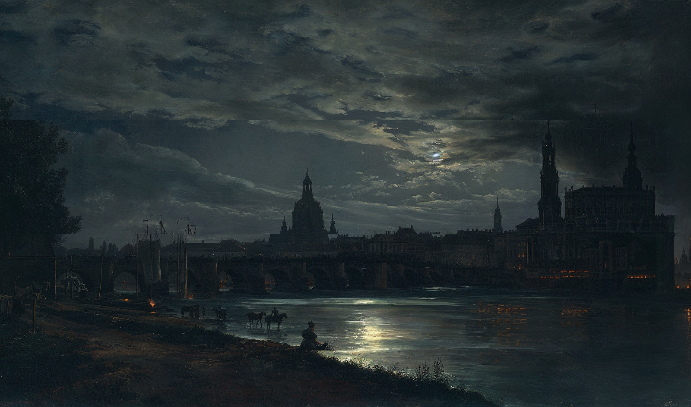

# Process Explanation

## Input Image

<details>
<summary>Details</summary>

```python
# create_config()
# /src/project/create_config.py

original_input_image_path = input("Enter the input image path: ")
config["original_input_image_path"] = original_input_image_path
input_image = Image.open(original_input_image_path)
config["input_image_width"] = input_image.width
config["input_image_height"] = input_image.height
```

</details>

## Salient Objects - Extract, Inpaint, Overlay (Optional)


<details>
<summary>Details</summary>



Input: *Course of Empire - Destruction* by Thomas Cole

#### Salient Object Segmentation




- GroundingDinoSAMSegment
- Generalized prompt tags: "salient objects, statue, skyline, skyscraper, pillar, flag, column, building, tree, mountain, planet, asteroid, comet, meteor, rainbow, waterfall, volcano, bridge, tunnel, railway, airport, harbor, clouds, tornado, hurricane, lightning, rays"
- User input prompts tags: Objects in the input image that span across multiple user-defined layers
  - In the above photo, it may also create good results to remove the diagonal column/building line on the left. It would create less overall motion in the final output but with more likelife results.

#### Salient Object Removal and Inpainting


- This version of the image with the salient object removed and inpainted is used as the start image for the parallax process
  - Otherwise, the salient objects which span multiple layers will be disjointed beyond acceptable levels (relative to other portions of the image) as the layers move at different speeds

#### Salient Object Alpha Layer Extraction


- In the final video output, the salient object is overlayed onto the video with motion equal to the motion of the lowest layer the object is in (with the common sense assumption that something moves according to the layer its base is in)
  - Alternatively, the object can be overlayed with little to no motion, which can often create striking/artistic results and serve to highlight the object (see rap video visualizers)

</details>

## Depth Maps Conditioning and Distance Calculation (Optional)


<details>
<summary>Details</summary>

- MiDaS Depth Approximation automatically calculates depth maps for images. This can be used to calculate the depth of each pixel in the image.
- The depth map serves two purposes, both optional:
  - It can be used to calculate the velocity of each layer, with the velocity being inversely proportional to the depth.
  - It can be used with ControlNet conditioning, to assure that the inpainting process creates intermediate frames with uniform depth.

</details>

## Initial Layer Segmentation (Optional)

<details>
<summary>Details</summary>

- GroundingDinoSAMSegment with user input prompts can be used to segment the image into layers. 
- This provides specific initial shifts for the layers, and is later used to determine the base height for each layer

</details>

## Finalize Parameters with User Input

<details>
<summary>Details</summary>


#### Direction Angle (0-360 degrees)


```python
# create_config()
# /src/project/create_config.py

print_list(
    [
        "Direction of Parallax (0-360 degrees)",
        "0 degrees is to the right",
        "90 degrees is up",
        "180 degrees is left",
        "270 degrees is down",
    ]
)
direction = float(input("> "))
# handle if given negative angle
if direction < 0:
    direction = 360 + direction
# convert to 0-360 form
direction = direction % 360
direction_theta = math.radians(direction)
config["direction"] = direction
config["direction_theta"] = direction_theta
int_direction = int(direction)
if int_direction == 0:
    config["velocity_vector"] = (1, 0)
elif int_direction == 180:
    config["velocity_vector"] = (-1, 0)
elif int_direction == 90:
    config["velocity_vector"] = (0, 1)
elif int_direction == 270:
    config["velocity_vector"] = (0, -1)
else:
    config["velocity_vector"] = (
        math.cos(direction_theta),
        math.sin(direction_theta),
    )
```
#### Number of Layers

```python
# create_config()
# /src/project/create_config.py

layers = []
if not using_segmentation:
    num_layers = int(input("Number of Layers: "))

    for i in range(num_layers):
        layers.append({})
```

#### Layer Heights

```python
# create_config()
# /src/project/create_config.py

if not using_segmentation:
    print_list(
        [
            "Layers start from the top of the image and go down",
            "The top layer is Layer 0. The bottom layer is Layer N-1.",
        ]
    )
    for i in range(num_layers):
        if i == len(layers) - 1:
            print_list(
                [
                    "The last layer is calculated automatically",
                    "to ensure the entire image is covered.",
                ]
            )

            total_height_before_last_layer = sum(
                [layer["height"] for layer in layers[:-1]]
            )
            height_last_layer = input_image.height - total_height_before_last_layer
            print(f"Height of last layer: {height_last_layer}px")
            layers[i]["height"] = int(height_last_layer)
        else:
            layers[i]["height"] = int(input(f"Height of Layer {i} (in pixels): "))
```

#### Layer Distances

Approximate Depth/Distance of each layer from the camera


```python
# DEFAULT_DISTANCES
# /src/constants.py

DEFAULT_DISTANCES = {
    "cloud_layer" : {
        "mathematically_accurate_distance" : 16.18,
        "creates_best_output_distance" : 280
    },
    "horizon_layer" : {
        "mathematically_accurate_distance" : .15,
        "creates_best_output_distance" : 50
    },
    # Past depth of field in landscape paintings
    "background_layer" : {
        "mathematically_accurate_distance" : 689,
        "creates_best_output_distance" : 690
    },
    "foreground_layer" : {
        # Arbitrary base
        "mathematically_accurate_distance" : 800,
        "creates_best_output_distance" : 800
    }
}
```

```python
# create_config()
# /src/project/create_config.py

if not using_depth_maps:
    print_list(
        [
            "You can think of distance in terms of whatever unit you want,",
            "as long as it's consistent.",
            "For example, you can give distance on a scale of 0-100,",
            "where 0 is right in front of the camera",
            "and 100 is the horizon.",
        ]
    )

    for i in range(num_layers):
        layers[i]["distance"] = input(f"Distance of Layer {i} from the camera: ")
        # Clean any units or non-numeric characters and convert to float
        layers[i]["distance"] = re.sub("[^0-9]", "", layers[i]["distance"])
        layers[i]["distance"] = float(layers[i]["distance"])

# Convert distances to ratios
total_distance = sum([layer["distance"] for layer in layers])
for i in range(num_layers):
    layers[i]["distance_ratio"] = layers[i]["distance"] / total_distance
```

***NOTE:*** Distances can also be caculated mathematically given the angle of the camera and the height of the layer, but upon testing, it doesn't necessarily improve the quality of outputs. Probably because the subjective quality of outputs doesnt correlate very strongly with the mathematical exactness of layer velocities. The human optical system automatically contextualizes visual errors before they reach the level of cognitive awareness either way, that's why we can simulate parallax with 2D images in the first place.

#### Smoothness

```python
# create_config()
# /src/project/create_config.py

print_list(
    [
        "Smoothness",
        "More smoothness means intermediate frames, and a smoother transition",
        "at the cost of more time and memory",
        "\nRecommended: 16",
    ]
)

config["smoothness"] = int(1000 / int(input("(int) Smoothness (0-100): ")))

print_list(
    [
        "Seconds Per Step",
        "The base speed of the final video",
        "The more seconds per step, the slower the parallax motion, which usually creates better looking results but the motion may become unnoticeable",
        "\nRecommended: 5, assuming a smoothness of 16",
    ]
)
config["seconds_per_step"] = int(input("(int) Seconds Per Step: "))
```

***NOTE:*** In essence, each step will be a "perfect" image, in the sense that it was created with full context. The period of time wherein the layers are moving at different speeds toward the next step will be the period where the layers are "mismatched" and there will inevitably be illogical disjointedness in the reality of the picture. The less distance between each step means the less total time that the layers are disjointed. 

***NOTE:*** On the other hand, a higher number of iterations can amplify the non-convergence of the inpainting process. That is, if the inpainting or diffusion models/parameters are in any way divergent, each step may tend towards a (potentially radically) different "reality". This effect can be observed in img2vid processes, where there is a trade-off between FPS and inter-frame communication (given an environment where virtual memory is a limiting factor)

#### FPS

```python
# create_config()
# /src/project/create_config.py

print_list(
    [
        "Frame Per Second of the Output Video",
        "The speed is different from the seconds per step",
        "A video moving across one step every 5 seconds can be 10 FPS or 60 FPS",
        "FPS just determines how many total frames are created using the function that creates frames with the coordinate(time) function",
        "Increasing FPS will increase the total number of frames, but the speed of the parallax motion will remain the same",
        "Compared with the other config options, the performance impact of creating higher FPS is very low",
        "Recommended: 30",
    ]
)
config["fps"] = int(input("(int) Frame Per Second of the Output Video: "))
```
</details>

## Velocity Calculations

<details>
<summary>Details</summary>

```python
# create_config()
# /src/project/create_config.py

for i in range(num_layers):
    layers[i]["velocity"] = (
        config["velocity_vector"][0]
        * layers[i]["distance_ratio"]
        * config["smoothness"],
        config["velocity_vector"][1]
        * layers[i]["distance_ratio"]
        * config["smoothness"],
    )
    # Round to 1 decimal place
    layers[i]["velocity"] = (
        round(layers[i]["velocity"][0], 1),
        round(layers[i]["velocity"][1], 1),
    )
```

</details>

## Number of Steps Calculation

<details>
<summary>Details</summary>

```python
# create_config()
# /src/project/create_config.py

# Each layer requires enough steps so that it can move the full distance of the image
# This is calculated by dividing the distance of the layer by the velocity of the layer
for i in range(num_layers):
    if layers[i]["velocity"][0] == 0:
        layers[i]["steps_x"] = 0
    else:
        layers[i]["steps_x"] = abs(
            int(input_image.width / layers[i]["velocity"][0])
        )
    if layers[i]["velocity"][1] == 0:
        layers[i]["steps_y"] = 0
    else:
        layers[i]["steps_y"] = abs(
            int(input_image.height / layers[i]["velocity"][1])
        )

config["max_steps"] = abs(max([layers[i]["steps_x"] for i in range(num_layers)]))

config["layers"] = layers
return config
```

***NOTE:*** The number of steps will always be the max steps required by the slowest layer. But each layer needs its own steps to determine how many output layers are used in the stitching process.

</details>

## Step Process 1 - Cropping and Masking (Repeated `MAX_STEPS` Times)

<details>
<summary>Details</summary>

1. Crop current step's start image into horizontal layers based on the layer heights
2. Crop each layer based on its velocity (essentially shifting it outside the base canvas in *velocity* vector distance/direction)
3. Composite the layers back onto the original canvas alpha, flush/aligned with the direction of the velocity vector
   1. E.g., if the direction is left (180 degrees), the layers are cropped `velocity` pixels from their left side, and then composited onto the original canvas flush with the left side of the canvas
4. Add alpha layer or mask to the canvas's empty space





</details>

## Step Process 2 - Inpaint Mask Preprocessing (Optional) (Repeated `MAX_STEPS` Times)


<details>
<summary>Details</summary>

Each step optional, with user experimentation suggested to determine the best results. Generally, this order should be followed:

1. Grow mask 
   1. in the direction opposite of the velocity vector
   2. in a magnitude equal to the extent of feathering/blurring
2. Taper/Round corners
3. Mask blur
   1. Gaussian blur
   2. Blur radius
   3. Lerp alpha
   4. Falloff ratio / decay factor
4. Mask feathering




</details>


## Step Process 3 - Inpainting (Repeated `MAX_STEPS` Times)

<details>
<summary>Details</summary>

- Inpaint the composited layers such that the process uses the entire context.
- (Optional) Iterative Interrogation/Tagging at each step -> prepend to positive prompt




*This output is the start image for the next step*

</details>

## Step Process 4 - Re-Separate Layers (Repeated `MAX_STEPS` Times)

<details>
<summary>Details</summary>

Crop the inpainted image back into layers based on the layer heights


```python
# Psuedocode

for i in range(num_layers):
    layers[i]["step_outputs"] = []
```

```python
# Psuedocode

for i in range(num_layers):
    layers[i]["step_outputs"].append(
        inpainted_recropped_layers[i]
    )
```


</details>

## Repeat *Step Process* `MAX_STEPS` Times


<details>
<summary>Details</summary>

```python
# Psuedocode

start = START_IMAGE
for i in range(MAX_STEPS):
    # Separate start image into layers
    cropped_layers = [crop_layer(layer, start) for layer in layers]
    # Shift layers based on velocity
    shifted_layers = [shift_layer(layer) for layer in cropped_layers]
    # Composite layers onto base canvas, flush with the direction of the velocity vector
    composited_layers = composite_layers(shifted_layers, base_canvas)
    # Preprocess mask
    preprocessed_composite = preprocess_mask(composited_layers)
    # Inpaint
    inpainted_output = inpaint(composited_layers)
    # Re-separate layers
    inpainted_recropped_layers = [crop_layer(layer, inpainted_output) for layer in layers]
    for i in range(num_layers):
        layers[i]["step_outputs"].append(
            inpainted_recropped_layers[i]
        )

    start = inpainted_output
```

</details>


## Create VideoClip for each Layer

<details>
<summary>Details</summary>

1. Crop the inpainted region from each layer step output
2. Stitch all the cropped regions onto the original associated layer according to the vector of motion
3. Create `moviepy.editor.VideoClip` by passing a function that takes a time t and returns the frame at time t
   1. The duration of each layer is same, but the distance covered will be different (the basis of the parallax effect) because the inpaint region of the steps differs per layer

```python
# class Layer
# /src/layers/layer.py

duration = int(self.total_steps * self.project_config["seconds_per_step"])
output_vid_width = self.original_layer["image"].width
# total_width = self.stitched_inpainted_regions["image"].width

image_clip = ImageClip(self.stitched_inpainted_regions["fullpath"])

def make_frame(t):
    x = int(self.slide_distance * (t / duration))
    return image_clip.get_frame(t)[:, x : x + output_vid_width]

layer_videoclip = VideoClip(make_frame, duration=duration)
```

</details>

## Composite Layer Videos

<details>
<summary>Details</summary>

Composite the layer clips onto one another according to the vector of motion in order to create the final video.

```python
# class Project
# /src/project/project.py

def video_from_layer_frames(self):
    """
    Create a final video from the frames.

    self.layer_clips is a list of lists of VideoClip instances.
    Each list of VideoClip instances represents a layer.
    The layers should be stacked according to the vector of motion.

    This function creates a final video by compositing the layer clips and saving it to the specified output path.
    """

    video_composite = CompositeVideoClip(
        self.layer_clips, size=self.input_image.size
    )

    output_dir = os.path.join(self.project_dir_path, OUTPUT_VIDEO_PATH)
    if not os.path.exists(output_dir):
        os.makedirs(output_dir)
    output_path = os.path.join(output_dir, f"{self.name}-final_parallax_video.mp4")

    video_composite.write_videofile(
        output_path,
        codec=VIDEO_CODEC,
        fps=self.get_config()["fps"],
    )

    print(f"\n\nFinal video saved to {output_path}\n")
```

</details>

## Frame Interpolation

<details>
<summary>Details</summary>

Interpolate the frames of each layer to match the FPS of the final video

</details>

## Video Editing

<details>
<summary>Details</summary>

Various techniques can further the illusion of lifelike parallax, such as:

#### Effects

- Add effects which contribute to the linear temporal consistency of the video
    - E.g., a consistent moonlight ray VFX overlayed on the entire video
    - E.g., a consistent rain overlayed on the entire video
    - E.g., Osciilating distortion across frames

#### Sound

Sound effects can be added to the video to further enhance the illusion of depth. For example, the sound of wind or birds can be added to the background layers, while the sound of footsteps or voices can be added to the foreground layers.

Sound effects can vary in amplitude, attenuation, delay in a rate proportional to the simulated motion of the given layer

Possible sounds:
- Foley
- Music
- Sound Effects
- Ambiance
- Voices


#### Color Correction

...

</details>

## Export Output


<details>
<summary>Details</summary>

Important export configuration options
- Codec
- Frame blending type
- Keyframe group size
- Bitrate

</details>